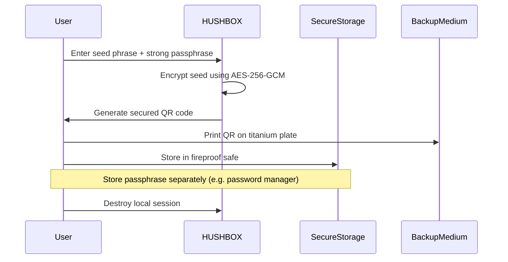
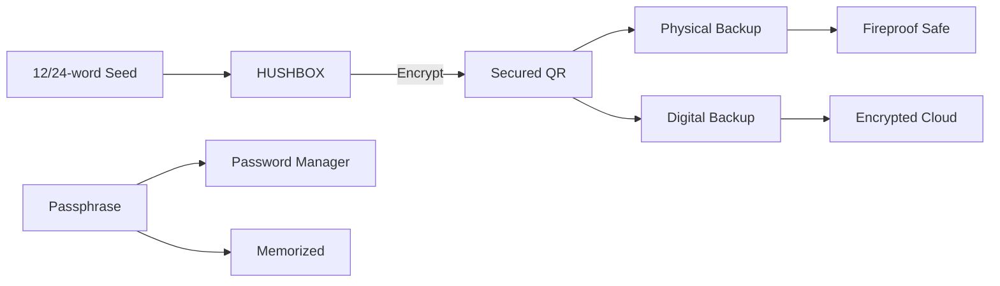
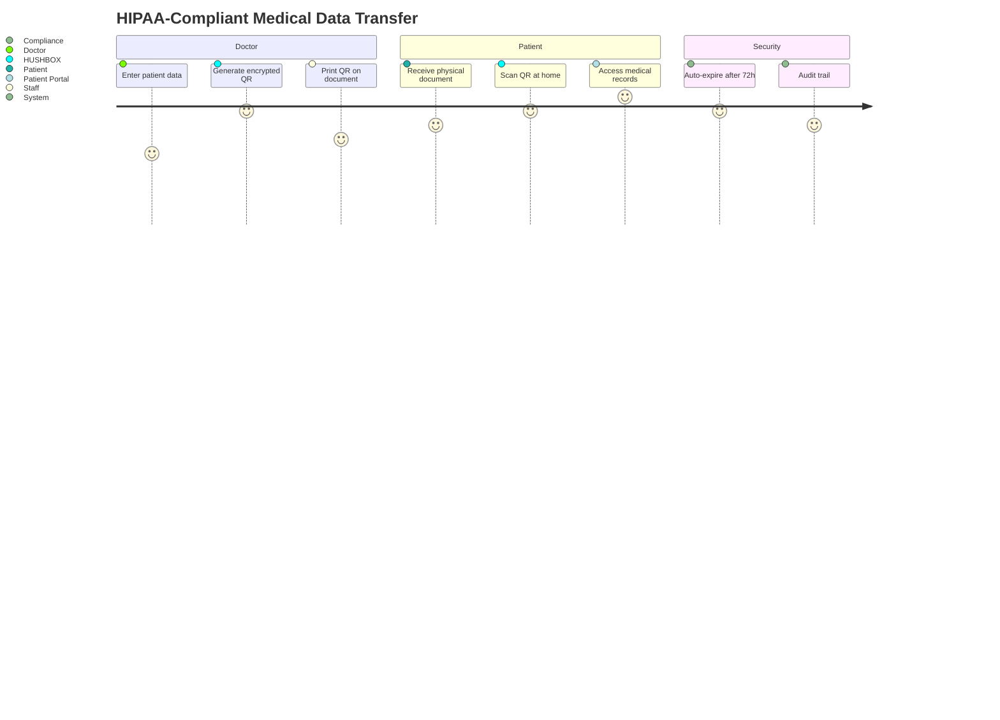
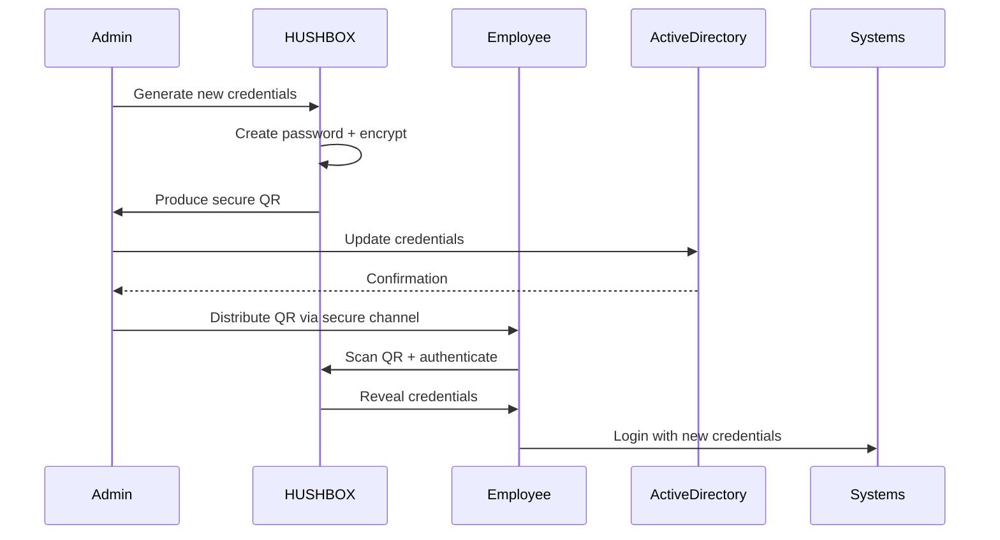
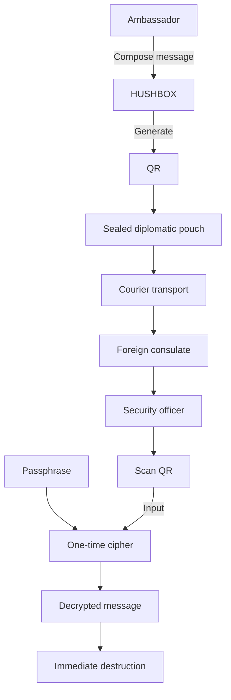
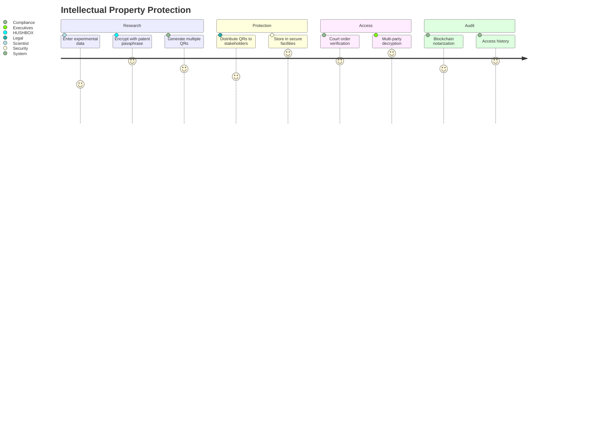
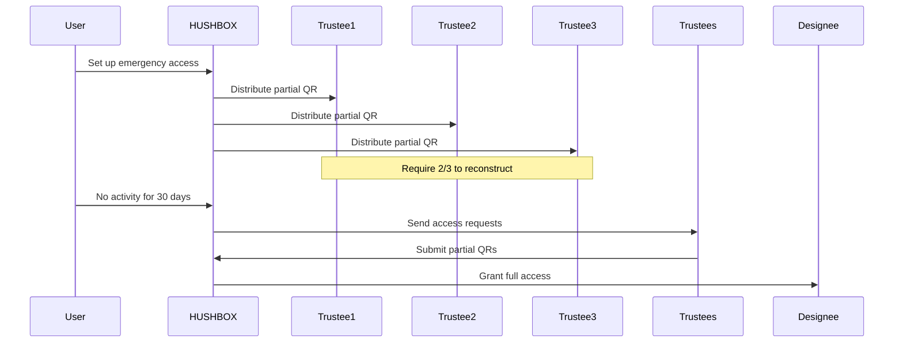
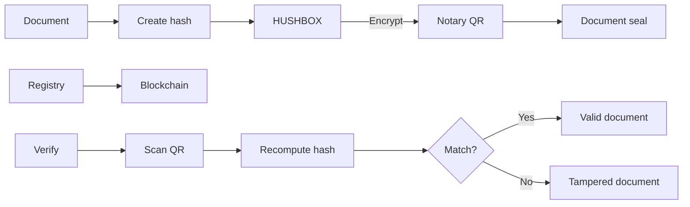
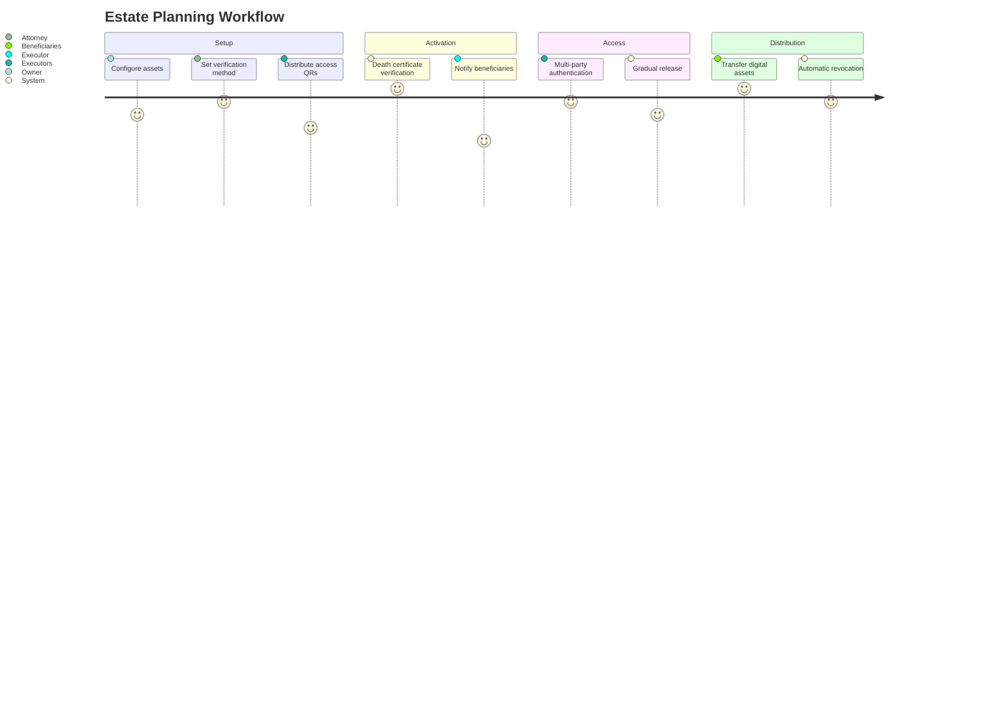

# 🔒 HUSHBOX - Additional Security Workflows

## 💰 Crypto Wallet Seed Backup Workflow



### Security Features for Crypto Seeds
- **Multi-Location Storage**: QR physical backup + digital passphrase
- **Redundancy**: Create multiple QR backups for different locations
- **Tamper Evidence**: QR contains HMAC signature to detect alterations
- **Time-Lock**: Optional delayed decryption feature
- **Plausible Deniability**: Seed appears as random data in QR



## 🏥 Medical Records Transfer Workflow



### Medical Use Case Features
- **HIPAA Compliance**: End-to-end encrypted PHI (Protected Health Information)
- **Temporary Access**: Records auto-delete after set period
- **Access Control**: PIN-protected decryption
- **Emergency Access**: Break-glass mechanism for authorized personnel
- **Compliance Logging**: Tamper-proof access records

## 🔑 Enterprise Password Rotation Workflow



### Security Advantages
- **No Plaintext Transmission**: Credentials never sent via email/chat
- **One-Time Use**: QR invalidates after first scan
- **Biometric Verification**: Optional face/fingerprint unlock
- **Usage Analytics**: Track credential distribution
- **Auto-Rotation**: Schedule regular password updates

## 🗝️ Diplomatic Communication Workflow



### Diplomatic Security Features
- **Plausible Deniability**: Message appears as random data if intercepted
- **Duress Detection**: Hidden warning if decrypted under coercion
- **Multi-Party Auth**: Require 2 officers to decrypt
- **Geofencing**: Only decrypt in authorized locations
- **Ephemeral Storage**: Zero device persistence

## 🧪 Research Data Protection Workflow



### Research Protection Features
- **Patent-Safe Encryption**: Pre-filing data protection
- **Shamir's Secret Sharing**: Split across multiple QRs
- **Temporal Locks**: Decrypt only after specific date
- **Non-Repudiation**: Cryptographic proof of access
- **Data Inheritance**: Dead man's switch mechanism

## 🚨 Suggested Additional Workflows

### 1. Emergency Access System


### 2. Notary Verification System


### 3. Digital Inheritance System


## 🛡️ Implementation Tips for All Workflows

1. **Physical Backup Best Practices**:
   - Use archival-quality paper or titanium plates
   - Laminate with UV-protective coating
   - Store in fireproof/waterproof containers
   - Create geographical distribution (multiple locations)

2. **Passphrase Management**:
   ```mermaid
   pie
       title Passphrase Storage Methods
       "Password Manager" : 45
       "Physical Vault" : 30
       "Memorization" : 15
       "Split Knowledge" : 10
   ```

3. **Security Verification Schedule**:
   - Monthly: Test decryption process
   - Quarterly: Rotate master passphrases
   - Annually: Replace physical backups
   - Biannually: Security audit penetration test

4. **Disaster Recovery**:
   - Maintain 3-2-1 backup rule:
     - 3 copies of QR
     - 2 different media types (paper/metal/digital)
     - 1 offsite location

These workflows demonstrate HUSHBOX's versatility across high-security scenarios. Each implementation maintains the core principles of zero-server architecture and client-side encryption while adapting to specific industry requirements.
