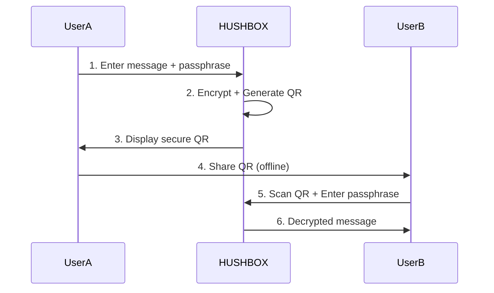
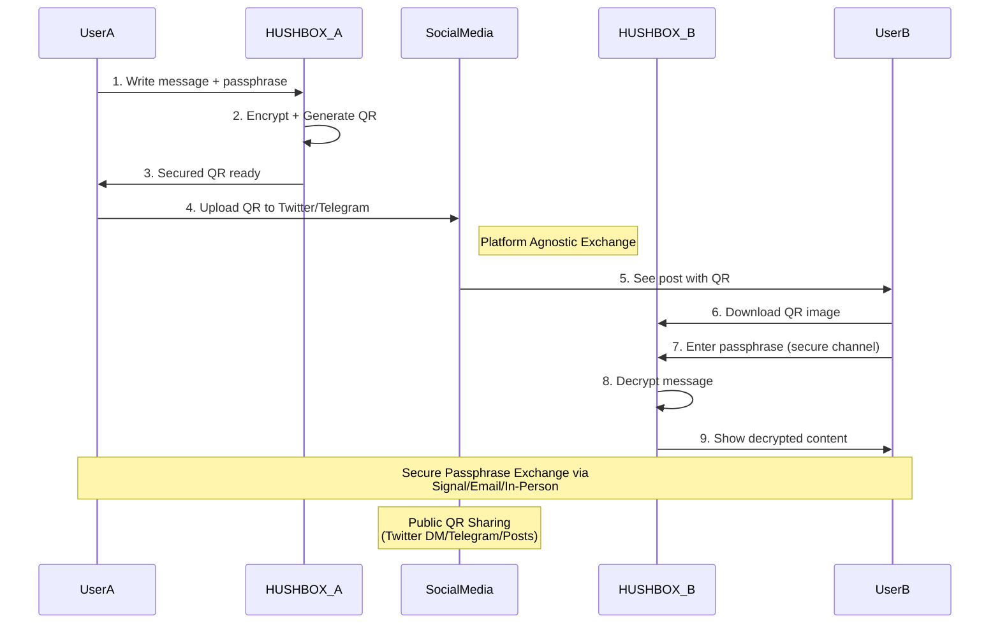

# HUSHBOX - Secure Messaging with QR Encryption 🔒

 *Example of encryption/decryption flow*

## 🌟 Project Overview
**HUSHBOX** is a privacy-first communication tool that combines military-grade encryption with QR code technology to enable secure message transmission. Designed for users who value digital privacy, it implements modern cryptographic standards to protect your communications from prying eyes.

Key Characteristics:
- **Zero-Server Architecture**: Messages never touch external servers
- **Ephemeral Design**: No message storage or tracking
- **Open Source**: Fully transparent security implementation
- **PWA Ready**: Installable as a progressive web app

## 🚀 Key Features

### 🔐 Core Security
- AES-256-GCM encryption with HMAC integrity protection
- PBKDF2 key derivation (250,000 iterations)
- Compressed payloads for efficient QR encoding
- Anti-brute force protection (5 attempts limit)

### 📱 User Experience
- Responsive design with mobile-first approach
- Real-time passphrase strength indicators
- Animated QR codes with custom branding
- Camera QR scanning (mobile devices)
- Social media integration for secure sharing

### 🛡️ Advanced Protections
- IV time-stamping for replay attack prevention
- Memory sanitization after operations
- Secure content disposal
- Tamper-evident payload design

## 🛠️ Technical Stack

### Cryptography
| Component              | Specification                          |
|------------------------|----------------------------------------|
| Encryption Algorithm   | AES-GCM 256-bit                       |
| Key Derivation         | PBKDF2-HMAC-SHA256                    |
| Iterations             | 250,000                               |
| IV Generation          | Crypto-safe RNG + timestamp           |
| Data Integrity         | HMAC-SHA256                           |

### Frontend
- **QR Generation**: `qrcode@1.5.1`
- **QR Decoding**: `jsqr@1.4.0`
- **Compression**: `pako@2.1.0`
- **UI Framework**: Pure CSS Grid/Flex
- **Icons**: Font Awesome 6

## 📥 Installation & Usage

### Local Deployment
```bash
git clone https://github.com/MPetovick/HUSHBOX.git
cd HUSHBOX
# Serve using local web server
python3 -m http.server 8000
```
Open `http://localhost:8000` in modern browser

### Web Version
Access live demo:  
[https://mpetovick.github.io/HUSHBOX](https://mpetovick.github.io/HUSHBOX)

## 🔄 Workflow Diagram



## 🖥️ Developer Guide

### Encryption Process
1. Passphrase validation (complexity rules)
2. Cryptographic salt generation
3. Key derivation (PBKDF2)
4. Data compression (zlib)
5. AES-GCM encryption
6. HMAC signature
7. Base64 encoding for QR

### Code Structure
```
HUSHBOX/
├── index.html          - Main application interface
├── styles.css          - Responsive styling
├── script.js           - Core encryption logic
├── manifest.json       - PWA configuration
└── assets/             - Icons & branding
```

## ⚠️ Security Considerations

### Best Practices
- Use 15+ character passphrases
- Share passphrases through secure channels
- Verify QR source before scanning
- Limit decryption attempts
- Use in private browsing sessions

### Implementation Notes
- Memory wiping after crypto operations
- Time-based nonce generation
- Compression side-channel protection
- Secure error handling
- CSP-compliant script loading

## 🤝 Contributing

We welcome security researchers and developers to help improve HUSHBOX:

1. Fork repository
2. Create feature branch (`git checkout -b feature/improvement`)
3. Commit changes (`git commit -am 'Add security enhancement'`)
4. Push to branch (`git push origin feature/improvement`)
5. Open Pull Request

Please report vulnerabilities via [security@hushbox.io](mailto:security@hushbox.io)

## 📜 License
MIT License - See [LICENSE](LICENSE) file

## 🌐 Contact & Community
- Official Telegram: [@HUSHBOX_QR](https://t.me/HUSHBOX_QR)
- Twitter Updates: [@HUSHBOXonline](https://twitter.com/HUSHBOXonline)
- Developer Blog: [hushbox.io/blog](https://hushbox.io/blog) *Coming Soon*

---

**HUSHBOX** - Your Digital Privacy Vault 🔏  
*Because your secrets deserve better than the cloud* ☁️❌


Aquí tienes un diagrama de flujo ampliado que incluye el intercambio a través de redes sociales:



**Flujo Detallado:**
1. **Creación Segura:** 
   - Usuario A escribe mensaje + passphrase fuerte
   - HUSHBOX cifra y genera QR con marca temporal

2. **Distribución Pública:**
   - Sube QR a plataforma social (Twitter DM, Telegram, post público)
   - El QR permanece cifrado/públicamente accesible

3. **Recepción Privada:**
   - Usuario B descarga imagen QR desde la red social
   - Introduce passphrase (previamente compartida por canal seguro)
   - HUSHBOX verifica integridad y descifra contenido

4. **Protección Multi-capa:**
   - Red Social: Solo transporta el QR cifrado
   - Canal Secundario: Transmite passphrase (fuera de banda)
   - TTL Automático: Los QRs contienen timestamp para caducidad

**Consideraciones de Seguridad en Redes Sociales:**
- 🛡️ Nunca compartir passphrase en la misma plataforma
- 🔄 Usar diferentes redes para QR y credenciales
- ⏳ Configurar caducidad del post según sensibilidad
- 🖼️ Usar formatos con pérdida (JPEG) para dificultar lectura automática
- 📍 Publicar en canales privados/DM vs. público abierto
