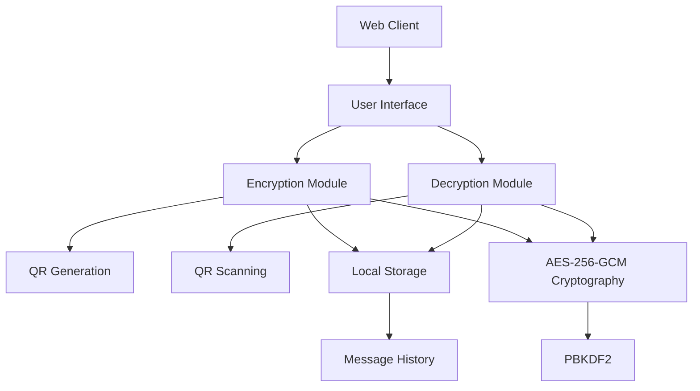
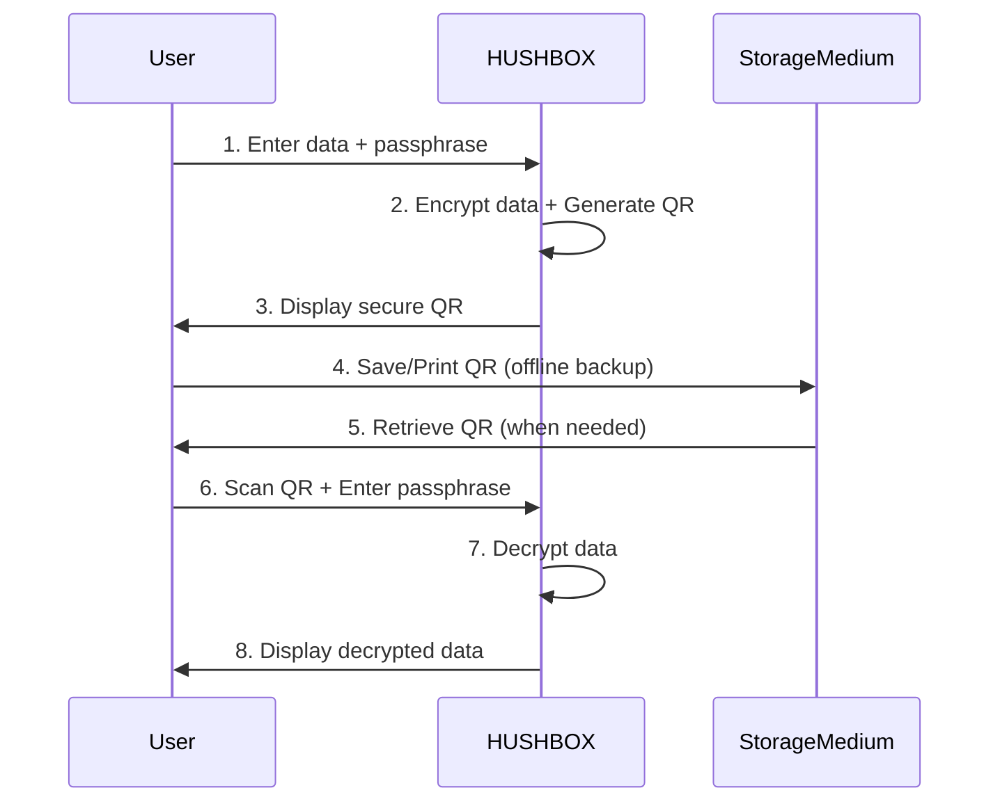
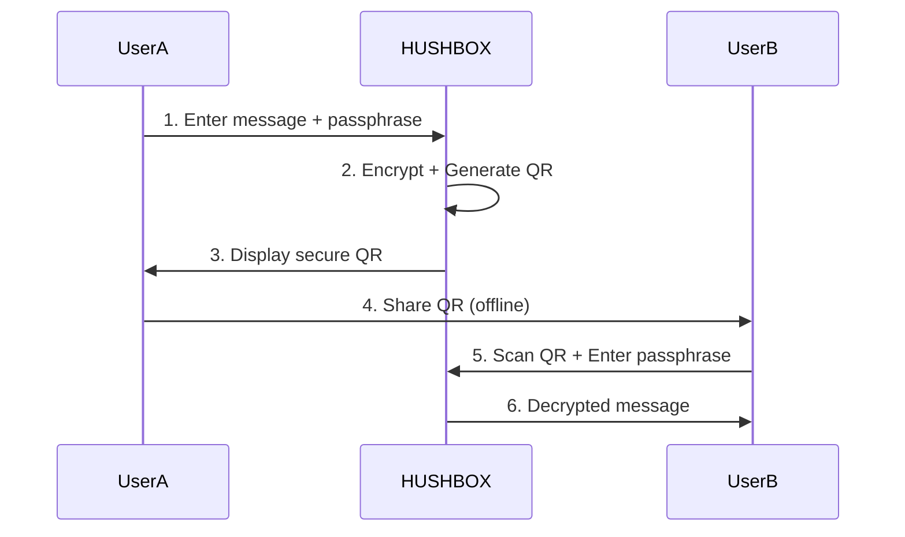
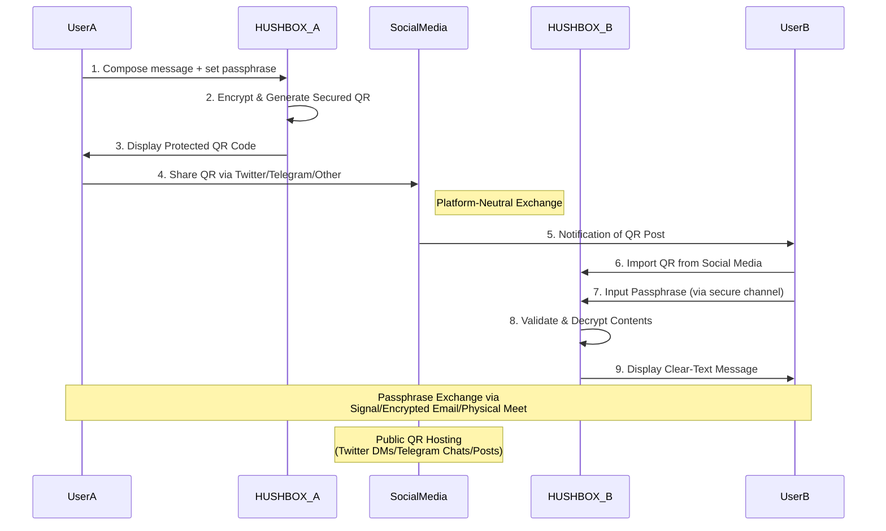

# 🔒 [HUSHBOX](https://www.hushbox.online) - Secure Messaging with QR Encryption 

**HUSHBOX** is a privacy-first communication tool that combines military-grade encryption with QR code technology to enable secure message transmission. Designed for users who value digital privacy, it implements modern cryptographic standards to protect your communications from prying eyes.

Key Characteristics:
- **Zero-Server Architecture**: Messages never touch external servers
- **Ephemeral Design**: No message storage or tracking
- **Open Source**: Fully transparent security implementation
- **PWA Ready**: Installable as a progressive web app
- **Offline Ready**: Works without an internet connection

## 🛠️ Technical Stack

|       **Category**       |        **Key Features**                                                                   |
|--------------------------|-------------------------------------------------------------------------------------------|
| 🔐 **Core Security**     | - AES-256-GCM encryption with HMAC integrity protection <br> - PBKDF2 key derivation (310,000 iterations) <br> - Compressed payloads for efficient QR encoding <br> - Anti-brute force protection (5 attempts limit) |
| 📱 **User Experience**   | - Responsive design with mobile-first approach <br> - Real-time passphrase strength indicators <br> - Animated QR codes with custom branding <br> - Camera QR scanning (mobile devices) *Coming Soon <br> - Social media integration for secure sharing |
| 🛡️ **Advanced Protections** | - IV time-stamping for replay attack prevention <br> - Memory sanitization after operations <br> - Secure content disposal <br> - Tamper-evident payload design|


### Cryptography
| Component              | Specification                          |
|------------------------|----------------------------------------|
| Encryption Algorithm   | AES-GCM 256-bit                       |
| Key Derivation         | PBKDF2-HMAC-SHA256                    |
| Iterations             | 310,000                               |
| IV Generation          | Crypto-safe RNG + timestamp           |
| Data Integrity         | HMAC-SHA256                           |

### Frontend
| Library      | Version | Use                           | SRI Integrity                            |
|--------------|---------|-------------------------------|------------------------------------------|
| **pako**     | 2.1.0   | Compression DEFLATE           | `sha256-7eJpOkpqUSa501ZpBis1jsq2rnubhqHPMC/rRahRSQc=` |
| **qrcode**   | 1.5.1   | QR Generation                 | `sha256-7GTYmrMJbc6AhJEt7f+fLKWuZBRNDKzUoILCk9XQa1k=` |
| **jsqr**     | 1.4.0   | QR Decoding                   | `sha256-TnzVZFlCkL9D75PtJfOP7JASQkdCGD+pc60Lus+IrjA=` |
| **jspdf**    | 2.5.1   | PDF export                    | `sha256-mMzxeqEMILsTAXYmGPzJtqs6Tn8mtgcdZNC0EVTfOHU=` |
| **zxcvbn**   | 4.4.2   | Passphrase validation         | `sha256-9CxlH0BQastrZiSQ8zjdR6WVHTMSA5xKuP5QkEhPNRo=` |
- **UI Framework**: Pure CSS Grid/Flex
- **Icons**: Font Awesome 6

## Installation & Usage

### 📁 Project Structure
```bash
HUSHBOX/
├── index.html          
├── script.js           
├── styles.css          
├── manifest.json       
└── favicon.png        
```

### 📥 Local Deployment
```bash
git clone https://github.com/MPetovick/HUSHBOX.git
cd HUSHBOX
# Serve using local web server
python3 -m http.server 8000
```
Open `http://localhost:8000` in modern browser or just click index.html

### 🌐 Web Version  
[https://www.hushbox.online](https://mpetovick.github.io/HUSHBOX)

## System Architecture

## 🔄 Workflow Diagram

**Backup Workflow:**

**Offline Workflow:**

**Online Workflow:**



1. **Secure Creation Phase:**
   - User A crafts message + 12+ character passphrase
   - HUSHBOX performs AES-256 encryption with time-stamped IV
   - Generates branded QR with anti-scanning protection

2. **Social Media Distribution:**
   - User posts encrypted QR to chosen platform(s)
   - Options: Twitter DM groups, Telegram channels, or public posts
   - QR contains no metadata about sender/receiver

3. **Cross-Platform Reception:**
   - User B saves QR image from social platform
   - Uses HUSHBOX to scan/upload the QR file
   - Enters pre-shared passphrase (via separate secure channel)

4. **Multi-Layer Security:**
   - Social Media: Acts as public transport layer only
   - Secondary Channel: For passphrase exchange (e.g., Signal)
   - Time-Based Protection: QR contains encrypted timestamp for expiration *Coming soon

**Security Best Practices for Social Sharing:**
- 🔒 Never share passphrase on same platform as QR
- 🌐 Use different networks for QR and credential exchange
- ⏳ Set post expiration where possible (e.g., Twitter Fleets)
- 🖼️ Convert QR to lossy formats (JPEG) to hinder automated scanning
- 🔗 Prefer private channels (DMs) over public posts
- 📍 Add visual noise to QR background when posting publicly
- ✉️ Split QR across multiple posts for high-sensitivity messages

This workflow enables secure communication through untrusted platforms while maintaining E2E encryption through the combination of QR steganography and separate credential exchange.

## ⚠️ Security Considerations

### Best Practices
- Use 15+ character passphrases
- Share passphrases through secure channels
- Verify QR source before scanning
- Limit decryption attempts
- Use in private browsing sessions

### Implementation Notes
- Memory wiping after crypto operations
- Time-based nonce generation
- Compression side-channel protection
- Secure error handling
- CSP-compliant script loading

## 📜 License
MIT License

## 🌐 Contact & Community
- Telegram: [@HUSHBOX_QR](https://t.me/HUSHBOX_QR)
- Twitter: [@HUSHBOXonline](https://twitter.com/HUSHBOXonline)

---

**HUSHBOX** - Your Digital Privacy Vault 🔏  
Because your secrets deserve better than the cloud ☁️✔
