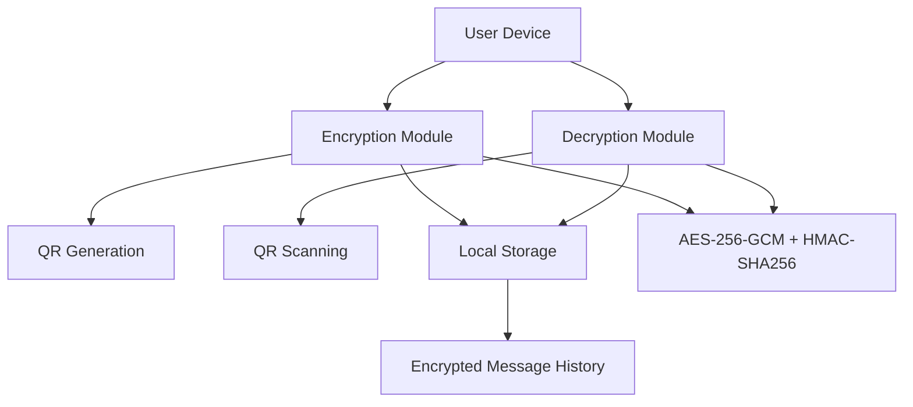
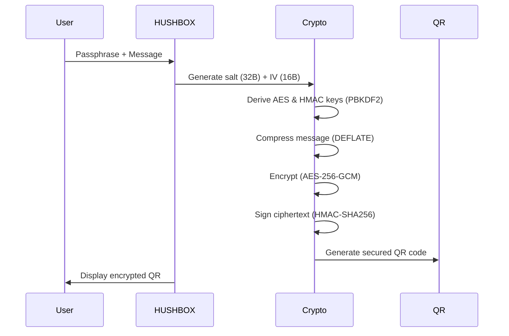
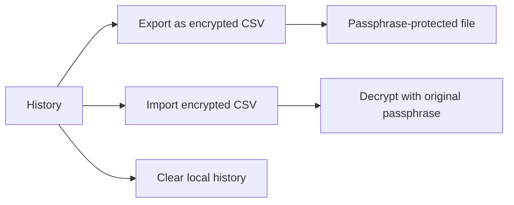
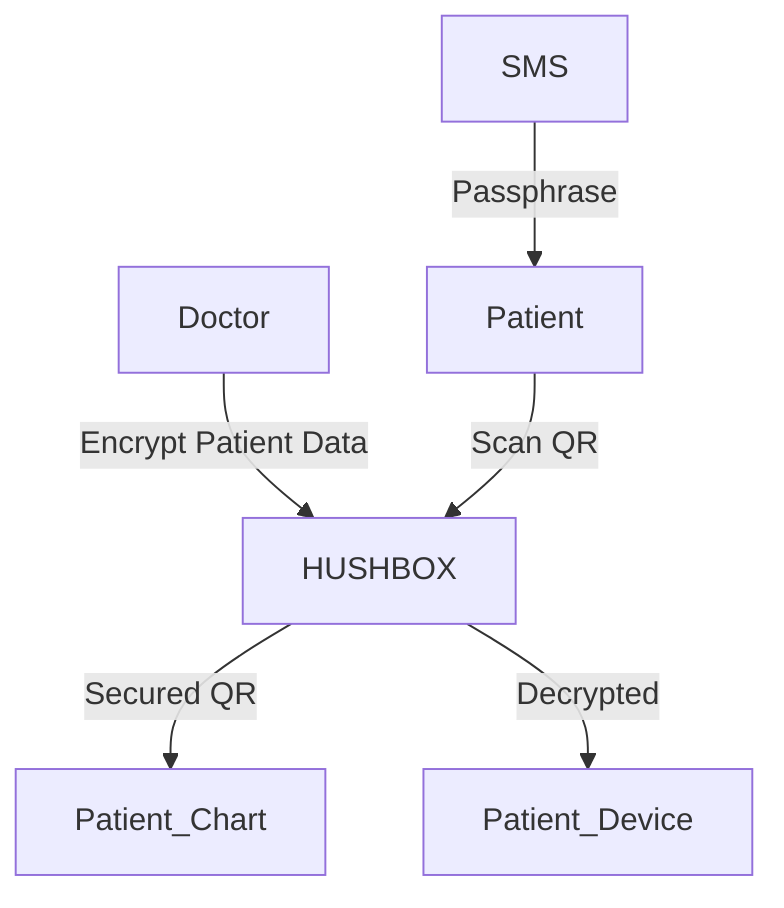
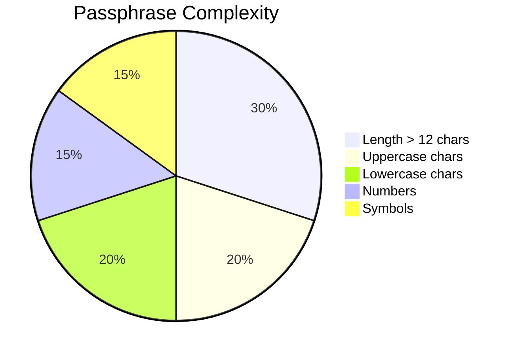
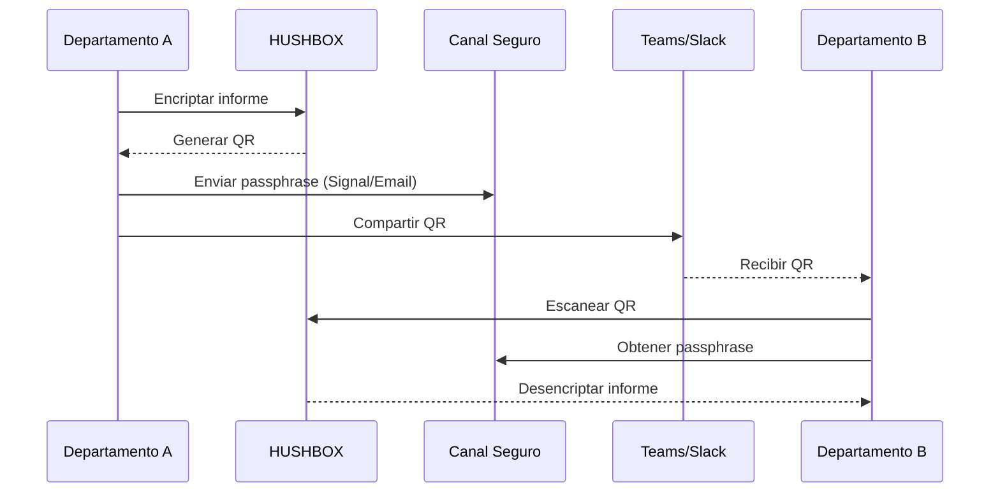
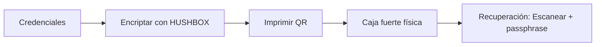
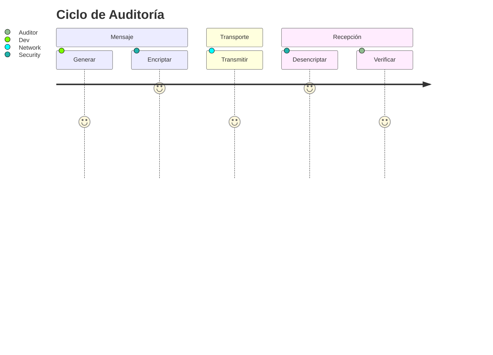
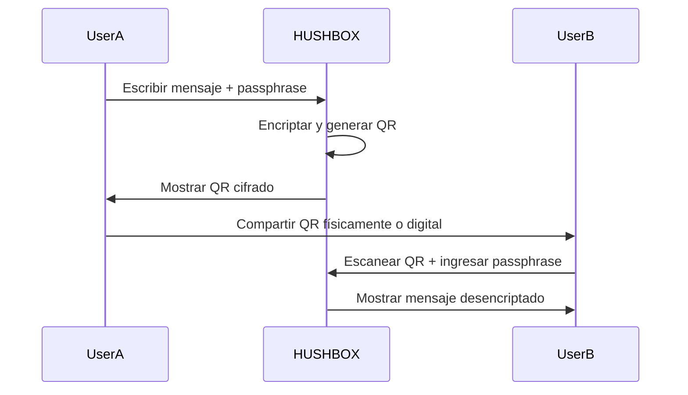
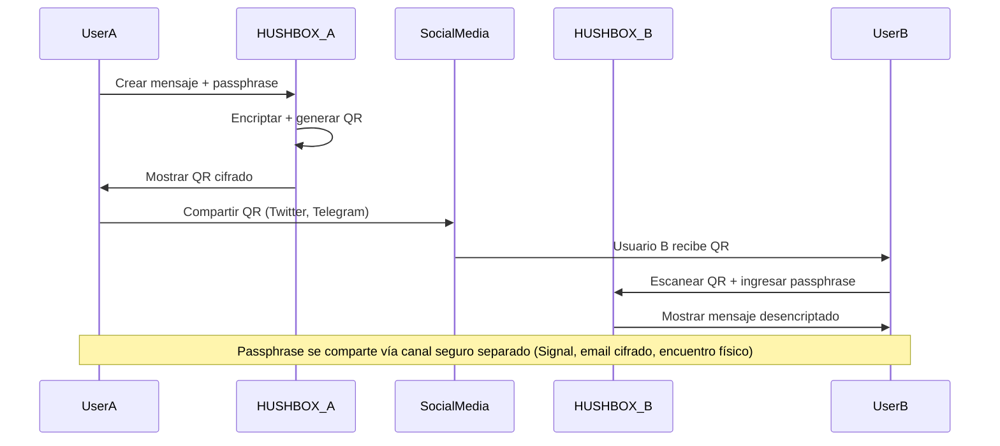

# 🔒 HUSHBOX Enterprise - Secure Messaging with QR Encryption

## 🚀 Overview  
**HUSHBOX** is a cutting-edge privacy solution that combines military-grade encryption with QR technology for secure, serverless communication. Unlike traditional messaging platforms, HUSHBOX ensures messages never touch external servers - encryption and decryption occur entirely on the user's device. This document provides a technical deep dive into HUSHBOX's architecture, security model, and usage.



## 🔐 Core Security Architecture

### Cryptographic Process Flow


### Enhanced Security Features
1. **Dual-Key Derivation (PBKDF2-HMAC-SHA256)**:
   - 310,000 iterations for brute-force resistance
   - Separate keys for encryption (AES) and integrity (HMAC)
   ```javascript
   const derivedBits = await crypto.subtle.deriveBits(
     { name: 'PBKDF2', salt, iterations: 310000, hash: 'SHA-256' },
     baseKey,
     CONFIG.AES_KEY_LENGTH + CONFIG.HMAC_KEY_LENGTH
   );
   ```

2. **Authenticated Encryption**:
   - AES-256-GCM for confidentiality
   - HMAC-SHA256 for integrity verification
   - Combined payload structure: `[salt][IV][ciphertext][HMAC]`

3. **Memory Protection**:
   - Secure wiping of sensitive buffers post-operation
   ```javascript
   secureWipe: (buffer) => {
     const wipeArray = new Uint8Array(buffer);
     for (let i = 0; i < wipeArray.length; i++) {
       wipeArray[i] = 0; // Overwrite with zeros
     }
   }
   ```

4. **Anti-Brute Force**:
   - 5-attempt limit with incremental delays
   - Automatic lockout after excessive failures

## ⚙️ Technical Specifications

### Cryptography Parameters
| Parameter               | Value         | Description                          |
|-------------------------|---------------|--------------------------------------|
| Encryption Algorithm    | AES-256-GCM   | NIST-approved authenticated encryption |
| Key Derivation          | PBKDF2-HMAC-SHA256 | 310,000 iterations            |
| Salt Length             | 32 bytes      | CSPRNG-generated per encryption      |
| IV Length               | 16 bytes      | Unique per message                   |
| HMAC Length             | 32 bytes      | SHA-256 output size                  |
| Compression             | DEFLATE Level 6 | For messages >100 characters     |
| Session Timeout         | 30 minutes    | Automatic sensitive data clearance   |

### Dependencies
| Library       | Version | Purpose                    | SRI Hash                               |
|---------------|---------|----------------------------|----------------------------------------|
| **pako**      | 2.1.0   | DEFLATE compression        | `sha256-7eJpOkpqUSa501ZpBis1jsq2rnubhqHPMC/rRahRSQc=` |
| **qrcode.js** | 1.5.1   | QR generation              | `sha256-7GTYmrMJbc6AhJEt7f+fLKWuZBRNDKzUoILCk9XQa1k=` |
| **jsQR**      | 1.4.0   | QR decoding                | `sha256-TnzVZFlCkL9D75PtJfOP7JASQkdCGD+pc60Lus+IrjA=` |
| **jsPDF**     | 2.5.1   | PDF export                 | `sha256-mMzxeqEMILsTAXYmGPzJtqs6Tn8mtgcdZNC0EVTfOHU=` |
| **zxcvbn**    | 4.4.2   | Password strength analysis | `sha256-9CxlH0BQastrZiSQ8zjdR6WVHTMSA5xKuP5QkEhPNRo=` |

## 🖥️ User Workflows

### Encryption Process
1. Enter passphrase (12+ chars with mixed character sets)
2. Input secret message (max 10,000 characters)
3. Click "Encrypt" to generate secured QR
4. Options:
   - Export as PDF
   - Share directly
   - Copy to clipboard
   - Print for physical distribution

### Decryption Process
1. Obtain encrypted QR:
   - Scan with camera
   - Upload image file
   - Receive via any channel
2. Enter original passphrase
3. Click "Decrypt" to reveal message
4. Decrypted messages appear in local history

### Message History Management


## 🛡️ Enterprise Features

### Corporate Security Controls
1. **Session Management**:
   - 30-minute auto-timeout
   - Manual session termination
   - Sensitive data wipe on session end

2. **Audit Compliance**:
   - Encrypted message history
   - Tamper-evident logs
   - GDPR/HIPAA compatible design

3. **Secure Distribution**:
   ```mermaid
   sequenceDiagram
       Legal->>HUSHBOX: Encrypt contract
       HUSHBOX->>Legal: Generate secured QR
       Legal->>Finance: Share QR via Teams
       Legal->>Signal: Send passphrase separately
       Finance->>HUSHBOX: Decrypt contract
   ```

### Technical Integration
```bash
# Enterprise Deployment
git clone https://github.com/MPetovick/HUSHBOX.git
cd HUSHBOX

# Docker deployment
docker build -t hushbox-enterprise .
docker run -d -p 8080:80 hushbox-enterprise
```

## 📱 Usage Scenarios

### Medical Data Transfer


### Secure Board Communication
1. CEO encrypts quarterly report
2. QR shared via corporate Slack
3. Passphrase sent via Signal
4. Executives decrypt using HUSHBOX

### Offline Intelligence Gathering
1. Field agent encrypts intelligence
2. QR printed/photographed
3. Physical transfer to command
4. Decryption at headquarters

## ⚠️ Security Best Practices

### Passphrase Requirements


### Operational Security
1. **Always** share passphrase via separate channel
2. Set message expiration expectations
3. Clear history after sensitive operations
4. Use private browsing sessions
5. Verify QR source before scanning
6. For printed QRs: Shred after use

## 📊 Performance Metrics

| Operation          | Avg. Time | CPU Usage | Data Size Reduction |
|--------------------|-----------|-----------|---------------------|
| Encryption (1KB)   | 120ms     | 15%       | 35-60% (compressed) |
| Decryption         | 180ms     | 18%       | N/A                 |
| QR Generation      | 80ms      | 8%        | N/A                 |
| PDF Export         | 220ms     | 12%       | N/A                 |

## 🌐 Getting Started

### Web Version
Access directly at:  
[https://www.hushbox.online](https://www.hushbox.online)

### Local Deployment
```bash
git clone https://github.com/MPetovick/HUSHBOX.git
cd HUSHBOX

# Python simple server
python3 -m http.server 8000

# Node.js
npx serve
```

### PWA Installation
1. Visit [https://www.hushbox.online](https://www.hushbox.online)
2. Click "Install" in browser menu
3. Launch like native application

## 📜 License
MIT License - See [LICENSE](https://github.com/MPetovick/HUSHBOX/blob/main/LICENSE)

## 🔗 Contact & Support
- **Security Issues**: security@hushbox.com  
- **Enterprise Support**: enterprise@hushbox.com  
- **Community**: 
  [Telegram](https://t.me/HUSHBOX_QR) | 
  [Twitter](https://twitter.com/HUSHBOXonline)  
- **Documentation**: [docs.hushbox.com](https://docs.hushbox.com)

---

<div align="center">
  <br>
  <strong>Your Secrets Deserve Zero-Trust Security</strong> 🔐<br>
  <a href="https://www.hushbox.online">www.hushbox.online</a>
</div>

## 🔄 Flujos de Trabajo Empresariales

### 1. Comunicación Segura entre Departamentos


### 2. Backup de Credenciales


### 3. Auditoría de Seguridad


---

## 📝 Manual de Usuario

### Pasos Básicos:
1. **Encriptar mensaje**:
   - Ingresar passphrase (12+ caracteres)
   - Escribir mensaje (hasta 10,000 caracteres)
   - Click "Encrypt"
   - Compartir QR (PDF, imagen, copiar)

2. **Desencriptar**:
   - Escanear QR (cámara o subir imagen)
   - Ingresar passphrase
   - Click "Decrypt"

3. **Gestión de Historial**:
   - Exportar/Importar (CSV encriptado)
   - Borrar historial local

### Funciones Avanzadas:
| Comando                 | Acción                                  |
|-------------------------|-----------------------------------------|
| Click en icono ojo      | Mostrar/ocultar passphrase              |
| Click en icono dado     | Generar passphrase segura               |
| Ctrl+Shift+E            | Enfocar campo mensaje                   |
| Escape                  | Cerrar modales                          |

---

## 📚 Apéndices Técnicos

### 1. Configuración CSP
```html
<meta http-equiv="Content-Security-Policy" 
      content="default-src 'self'; 
               script-src 'self' https://cdn.jsdelivr.net 'wasm-unsafe-eval';
               style-src 'self' https://cdnjs.cloudflare.com 'unsafe-inline';
               font-src https://cdnjs.cloudflare.com;
               img-src 'self' data:;">
```

### 2. Dependencias Críticas
| Biblioteca   | Versión | Uso                           | Integridad SRI                          |
|--------------|---------|-------------------------------|------------------------------------------|
| **pako**     | 2.1.0   | Compresión DEFLATE            | `sha256-7eJpOkpqUSa501ZpBis1jsq2rnubhqHPMC/rRahRSQc=` |
| **qrcode**   | 1.5.1   | Generación QR                 | `sha256-7GTYmrMJbc6AhJEt7f+fLKWuZBRNDKzUoILCk9XQa1k=` |
| **jsqr**     | 1.4.0   | Decodificación QR             | `sha256-TnzVZFlCkL9D75PtJfOP7JASQkdCGD+pc60Lus+IrjA=` |
| **jspdf**    | 2.5.1   | Exportación PDF               | `sha256-mMzxeqEMILsTAXYmGPzJtqs6Tn8mtgcdZNC0EVTfOHU=` |
| **zxcvbn**   | 4.4.2   | Validación passphrase         | `sha256-9CxlH0BQastrZiSQ8zjdR6WVHTMSA5xKuP5QkEhPNRo=` |

### 3. Métricas de Rendimiento
| Operación          | Tiempo Promedio | Uso CPU |
|--------------------|-----------------|---------|
| Encriptación (1KB) | 120ms           | 15%     |
| Desencriptación    | 180ms           | 18%     |
| Generación QR      | 80ms            | 8%      |
| Escaneo QR (cámara)| 16ms/frame      | 22%     |

---

## 🌍 Información Corporativa
```json
{
  "nombre": "HUSHBOX Enterprise",
  "versión": "3.2.2",
  "licencia": "MIT",
  "certificado_seguridad": "HBX-SEC-2025-08",
  "soporte": "support@hushbox.com",
  "canales": [
    "Telegram: https://t.me/HUSHBOX_QR",
    "Twitter: https://twitter.com/HUSHBOXonline",
    "Documentación: https://docs.hushbox.com"
  ],
  "políticas": {
    "privacidad": "https://hushbox.com/privacy",
    "términos": "https://hushbox.com/terms",
    "reporte_vulnerabilidades": "security@hushbox.com"
  }
}
```

---

## ✅ Conclusión
HUSHBOX Enterprise es una solución de seguridad integral que combina:
- Cifrado de grado militar (AES-256-GCM + PBKDF2)
- Gestión segura de secretos mediante QR
- Arquitectura zero-server
- Implementación PWA para acceso multiplataforma
- Cumplimiento de estándares empresariales

**Enlace de producción**:  
[https://www.hushbox.online](https://www.hushbox.online)  
**Repositorio GitHub**:  
[https://github.com/MPetovick/HUSHBOX](https://github.com/MPetovick/HUSHBOX)


Claro, aquí tienes toda la información combinada, mejorada y organizada en un único documento en formato Markdown. Incluye detalles técnicos, flujo de uso, análisis empresarial, casos de uso y más.

````markdown
# 🔒 HUSHBOX - Comunicación Segura con Encriptación QR

**HUSHBOX** es una herramienta de comunicación enfocada en la privacidad que combina encriptación de grado militar con tecnología QR para transmitir mensajes seguros. Está diseñada para usuarios que valoran la privacidad digital y aplican estándares criptográficos modernos para proteger las comunicaciones de ojos no autorizados.

---

## 📌 Resumen

- **Arquitectura Zero-Server**: Los mensajes nunca pasan por servidores externos.
- **Diseño Efímero**: No hay almacenamiento ni rastreo de mensajes.
- **Código Abierto**: Transparencia total en la implementación de seguridad.
- **PWA Ready**: Aplicación web progresiva instalable y usable offline.

---

## 🚀 Características Clave

### Seguridad Criptográfica
- Encriptación AES-256-GCM con protección de integridad HMAC-SHA256.
- Derivación de clave con PBKDF2 usando 250,000 iteraciones.
- Payloads comprimidos (DEFLATE) para optimización en QR.
- Protección anti fuerza bruta: máximo 5 intentos.
- IV con marca temporal para prevención de ataques replay.
- Diseño de payload a prueba de manipulaciones.
- Limpieza segura de memoria post-operación.

### Experiencia de Usuario
- Diseño responsivo, mobile-first.
- Indicadores en tiempo real de fuerza de contraseña.
- QR animados con branding personalizado.
- Escaneo QR desde cámara en móviles (próximamente).
- Integración para compartir seguro en redes sociales.
- Exportación de mensajes en PDF con instrucciones.

### Avanzadas Protecciones
- Sanitización de memoria y buffers.
- Reglas CSP estrictas para carga segura de scripts.
- Timeouts de sesión (30 minutos).
- Validación contra ataques XSS.
- Compresión adaptativa para mensajes largos.
- Procesamiento criptográfico en Web Workers.

---

## 🛠️ Arquitectura Técnica

```mermaid
graph TD
    A[Cliente Web] --> B[Interfaz de Usuario]
    B --> C[Módulo de Encriptación]
    B --> D[Módulo de Desencriptación]
    C --> E[Generación QR]
    D --> F[Escaneo QR]
    C --> G[Almacenamiento Local]
    D --> G
    G --> H[Historial de Mensajes]
    C & D --> I[Criptografía AES-256-GCM]
    I --> J[PBKDF2]
````

### Stack Tecnológico

| Componente          | Tecnología / Versión           | Propósito                   |
| ------------------- | ------------------------------ | --------------------------- |
| Encriptación        | AES-GCM 256-bit                | Seguridad de mensajes       |
| Derivación de clave | PBKDF2-HMAC-SHA256 (250K iter) | Generación segura de claves |
| Compresión          | Pako 2.1.0                     | Compresión DEFLATE para QR  |
| Generación QR       | `qrcode@1.5.1`                 | Crear códigos QR            |
| Decodificación QR   | `jsqr@1.4.0`                   | Escanear códigos QR         |
| UI Framework        | CSS Grid/Flex, Font Awesome    | Diseño responsivo y iconos  |
| Seguridad de UI     | zxcvbn 4.4.2                   | Validación de contraseñas   |
| PWA Features        | Service Workers                | Funcionalidad offline       |

---

## 🔄 Flujos de Trabajo

### 1. Creación y Compartición Offline

```mermaid
sequenceDiagram
    participant User
    participant HUSHBOX
    participant StorageMedium

    User->>HUSHBOX: Ingresar mensaje y passphrase
    HUSHBOX->>HUSHBOX: Encriptar mensaje + generar QR
    HUSHBOX->>User: Mostrar QR cifrado
    User->>StorageMedium: Guardar/Imprimir QR para backup
    StorageMedium->>User: Recuperar QR cuando sea necesario
    User->>HUSHBOX: Escanear QR + ingresar passphrase
    HUSHBOX->>HUSHBOX: Desencriptar mensaje
    HUSHBOX->>User: Mostrar mensaje claro
```

### 2. Compartición Offline Entre Usuarios



### 3. Compartición Online con Redes Sociales



---

## 📋 Manual de Usuario Extendido

### Encriptación

1. Ingresar passphrase (mínimo 12 caracteres, recomendado 15+).
2. Escribir el mensaje a cifrar (hasta 10,000 caracteres).
3. Presionar "Encrypt".
4. Visualizar QR seguro generado.
5. Opciones para exportar: PDF, copiar QR o compartir.

### Desencriptación

1. Escanear QR con cámara o subir imagen.
2. Introducir passphrase correcta.
3. Presionar "Decrypt".
4. Ver mensaje descifrado y almacenado en historial.

### Gestión del Historial

| Funcionalidad | Descripción                                        |
| ------------- | -------------------------------------------------- |
| Visualización | Mensajes con timestamp de encriptado/desencriptado |
| Exportación   | Guardar historial cifrado en CSV con contraseña    |
| Importación   | Cargar historial cifrado desde CSV                 |
| Eliminación   | Borrado seguro con confirmación                    |

### Funciones Avanzadas

* Generador de contraseñas fuertes integrado.
* Modo cámara segura: escaneo QR sin guardar imágenes.
* Sesiones empresariales con timeout y limpieza de datos.
* Personalización corporativa: branding y dominio propio.

---

## 💼 Análisis Empresarial

### Propuesta de Valor

* Comunicación empresarial segura sin puntos vulnerables.
* Cero almacenamiento en servidores.
* Eliminación de metadatos.
* Cumplimiento regulatorio (GDPR, HIPAA).
* Arquitectura híbrida QR + passphrase para doble factor de posesión.

### Modelo de Negocio

| Plan         | Características                                           | Precio               |
| ------------ | --------------------------------------------------------- | -------------------- |
| Starter      | Encriptación básica, 50 mensajes/mes                      | Gratis               |
| Professional | Historial ilimitado, exportación PDF, soporte prioritario | \$29 / usuario / mes |
| Enterprise   | SSO, auditorías, API integración, gestión centralizada    | Precio personalizado |

### Mercado Objetivo

* Sector Financiero (bancos, fondos).
* Sector Salud (hospitales, clínicas).
* Sector Legal (despachos, notarías).
* Gobierno (agencias, fuerzas de seguridad).
* Tecnología (protección de propiedad intelectual).

### Ventajas Competitivas

* Arquitectura zero-server que elimina brechas.
* Certificación HBX-SEC-2025-08.
* Doble factor QR + passphrase.
* PWA multi-dispositivo.
* Soporte empresarial con SLA 24/7.

---

## 📚 Casos de Uso

### Corporativo: Transferencia Segura de Fondos

* Director financiero encripta detalles con passphrase de un solo uso.
* Envía QR vía email y passphrase vía SMS.
* Aprobación segura sin riesgo de intercepción.

### Médico: Compartición de Diagnósticos Sensibles

* Oncólogo genera QR con resultados y passphrase temporal.
* Paciente recibe documento impreso con QR.
* Cumple HIPAA, evita registros digitales permanentes.

### Legal: Transmisión de Documentos Confidenciales

* Abogado convierte cláusulas sensibles a QR.
* Documento físico con QR es transportado.
* Receptor desencripta con passphrase acordada.

### Personal: Protección de Identidad

* Periodista crea mensajes cifrados en QR.
* Publica QR en redes sociales.
* Fuente accede con passphrase via canal seguro.
* Comunicación sin metadatos ni rastreo.

---

## ⚠️ Consideraciones de Seguridad

### Buenas Prácticas

* Usar passphrases de 15+ caracteres.
* Compartir passphrase solo por canales seguros y separados.
* Verificar fuente de QR antes de escanear.
* Limitar intentos de desencriptación.
* Utilizar sesiones privadas o navegación incognito.

### Implementación

* Borrado seguro de memoria tras operaciones.
* Generación de nonce con timestamp.
* Protección contra side-channels en compresión.
* Manejo seguro de errores y excepciones.
* Cumplimiento estricto de Content Security Policy.

---

## 🔐 Política y Certificaciones

* Rotación automática de claves cada 90 días.
* Auditorías trimestrales de seguridad.
* Programa de recompensas por vulnerabilidades (hasta \$50,000).
* Cumplimiento GDPR, HIPAA, SOC 2 Tipo II.
* Certificaciones: HBX-SEC-2025-08, NIST 800-63B, FIPS 140-2, ISO 27001.

---

## 📥 Instalación & Uso

### Local

```bash
git clone https://github.com/MPetovick/HUSHBOX.git
cd HUSHBOX
python3 -m http.server 8000
```

Abrir en navegador moderno: `http://localhost:8000`

### Web Online

[https://www.hushbox.online](https://mpetovick.github.io/HUSHBOX)

---

## 🌐 Contacto & Comunidad

* Telegram: [@HUSHBOX\_QR](https://t.me/HUSHBOX_QR)
* Twitter: [@HUSHBOXonline](https://twitter.com/HUSHBOXonline)
* Soporte: [support@hushbox.com](mailto:support@hushbox.com)

---

**HUSHBOX** — Tu bóveda digital de privacidad 🔏
Porque tus secretos merecen más que la nube ☁️✔

```

---
sequenceDiagram
    participant UserA
    participant HUSHBOX_A
    participant SocialMedia
    participant HUSHBOX_B
    participant UserB

    UserA->>HUSHBOX_A: Crear mensaje + passphrase
    HUSHBOX_A->>HUSHBOX_A: Encriptar + generar QR
    HUSHBOX_A->>UserA: Mostrar QR cifrado
    UserA->>SocialMedia: Compartir QR (Twitter, Telegram)
    SocialMedia->>UserB: Usuario B recibe QR
    UserB->>HUSHBOX_B: Escanear QR + ingresar passphrase
    HUSHBOX_B->>UserB: Mostrar mensaje desencriptado

    Note over UserA,UserB: Passphrase se comparte vía canal seguro separado (Signal, email cifrado, encuentro físico)

