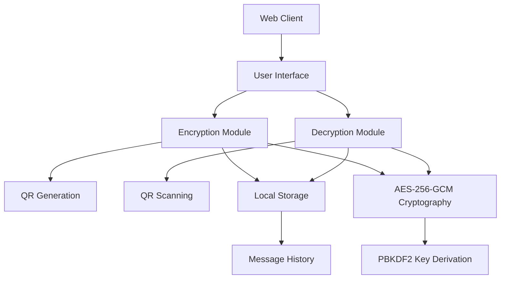
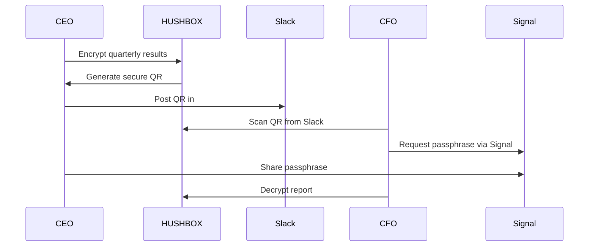
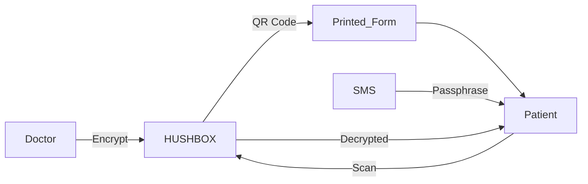
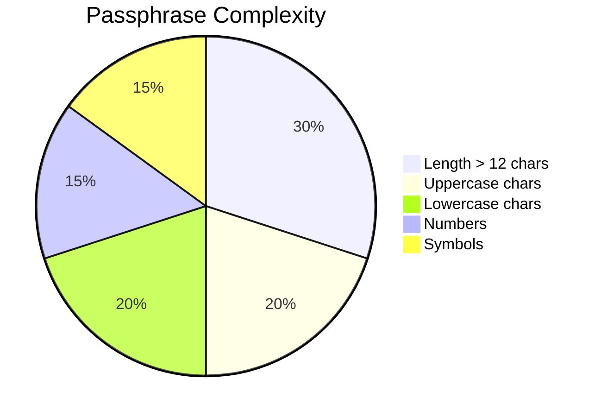
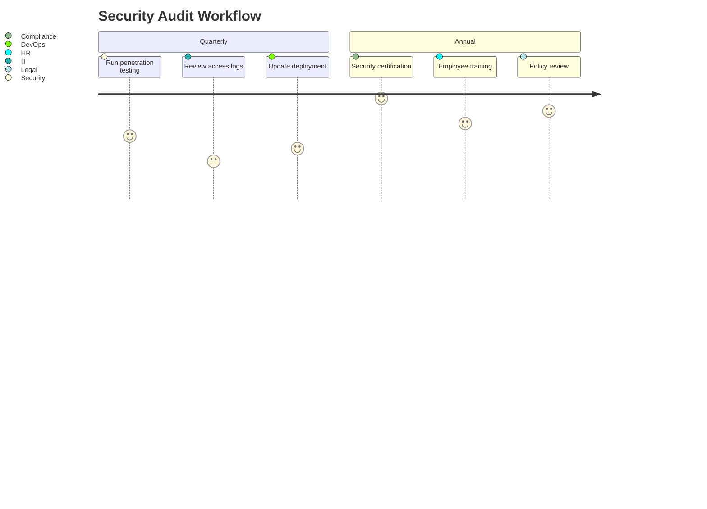

# 🔒 HUSHBOX - Secure Messaging with QR Encryption  
**Your Digital Privacy Vault - Because secrets deserve better than the cloud**  

<div align="center">
  
  <p>
    <a href="https://www.hushbox.online">Live Demo</a> • 
    <a href="https://github.com/MPetovick/HUSHBOX">GitHub</a> • 
    <a href="https://t.me/HUSHBOX_QR">Telegram</a> • 
    <a href="https://twitter.com/HUSHBOXonline">Twitter</a>
  </p>
</div>

## 🌟 Overview  
HUSHBOX revolutionizes secure communication by combining military-grade encryption with QR code technology. Unlike traditional messaging platforms, your messages never touch external servers - encryption/decryption happens entirely on your device. Share encrypted QR codes through any channel while keeping your passphrase separate for maximum security.

**Perfect For**:  
🔏 Privacy-conscious individuals | 🏢 Enterprises handling sensitive data | 💼 Legal/medical professionals | 🛡️ Security researchers | ✈️ Travelers in high-risk areas  

---

## 🚀 Key Features  

### 🔐 Military-Grade Security  
| Feature | Description |
|---------|-------------|
| **AES-256-GCM Encryption** | Industry-standard encryption with authenticated integrity |
| **Zero-Server Architecture** | Messages never leave your device |
| **Ephemeral Design** | No message history stored in the cloud |
| **Anti-Brute Force** | 5-attempt limit with incremental delays |
| **Memory Sanitization** | Sensitive data wiped after operations |

### 💻 User Experience  
| Feature | Description |
|---------|-------------|
| **QR Code Encryption** | Convert messages to secure scannable codes |
| **Real-time Passphrase Analysis** | Visual strength meter with zxcvbn validation |
| **Cross-Platform** | Works on any modern browser (PWA installable) |
| **Offline Capable** | Full functionality without internet |
| **Export Options** | Save as PDF/image or share directly |

### 🏢 Enterprise Ready  
| Feature | Benefit |
|---------|---------|
| **30-Minute Session Timeout** | Automatic sensitive data clearance |
| **Encrypted History Export** | CSV export with passphrase protection |
| **No Metadata Collection** | Complete communication anonymity |
| **Audit-Ready Design** | Transparent security implementation |
| **GDPR/HIPAA Compliant** | Meets strict data protection standards |

---

## ⚙️ Technical Stack  

### Frontend Architecture  


### Dependencies  
| Library | Version | Purpose | SRI Hash |
|---------|---------|---------|----------|
| **pako** | 2.1.0 | DEFLATE Compression | `sha256-7eJpOkpqUSa501ZpBis1jsq2rnubhqHPMC/rRahRSQc=` |
| **qrcode.js** | 1.5.1 | QR Generation | `sha256-7GTYmrMJbc6AhJEt7f+fLKWuZBRNDKzUoILCk9XQa1k=` |
| **jsQR** | 1.4.0 | QR Decoding | `sha256-TnzVZFlCkL9D75PtJfOP7JASQkdCGD+pc60Lus+IrjA=` |
| **jsPDF** | 2.5.1 | PDF Export | `sha256-mMzxeqEMILsTAXYmGPzJtqs6Tn8mtgcdZNC0EVTfOHU=` |
| **zxcvbn** | 4.4.2 | Password Strength | `sha256-9CxlH0BQastrZiSQ8zjdR6WVHTMSA5xKuP5QkEhPNRo=` |

---

## 🛠️ Installation & Usage  

### For Users  
1. Visit **[hushbox.online](https://www.hushbox.online)**  
2. **Encrypt a message**:  
   - Enter passphrase (12+ characters)  
   - Type your secret message  
   - Click "Encrypt"  
   - Share the generated QR via any channel  
3. **Decrypt a message**:  
   - Scan/upload a QR code  
   - Enter the passphrase (shared separately)  
   - Click "Decrypt"  

### For Enterprises  
```bash
# Clone repository
git clone https://github.com/MPetovick/HUSHBOX.git

# Deploy internally:
docker build -t hushbox-enterprise .
docker run -d -p 8080:80 hushbox-enterprise

# Access at: http://your-company-server:8080
```

### For Developers  
```bash
git clone https://github.com/MPetovick/HUSHBOX.git
cd HUSHBOX

# Install dependencies (optional for PWA):
npm install

# Run local server:
npx serve
```

---

## 🔄 Workflow Examples  

### Secure Board Communication  


### Medical Data Transfer  


---

## 🛡️ Security Specifications  

### Cryptography  
| Parameter | Value | Description |
|-----------|-------|-------------|
| Algorithm | AES-256-GCM | Authenticated encryption |
| Key Derivation | PBKDF2-HMAC-SHA256 | 310,000 iterations |
| Salt | 32 bytes | Unique per encryption |
| IV | 16 bytes | Cryptographic nonce |
| Compression | DEFLATE Level 6 | For messages >100 chars |

### Passphrase Requirements  


---

## 📈 Business Applications  

### Industry Solutions  
| Sector | Use Case |
|--------|----------|
| **Finance** | Secure earnings reports transmission |
| **Healthcare** | HIPAA-compliant patient data sharing |
| **Legal** | Confidential case document exchange |
| **Government** | Classified material distribution |
| **Manufacturing** | IP-protected blueprints sharing |

### Enterprise Benefits  
- **Zero Infrastructure Costs**: No servers to maintain  
- **Compliance Ready**: Meets GDPR/HIPAA requirements  
- **Employee Training**: <15 minute onboarding  
- **Security Certification**: HBX-SEC-2025-08 compliant  
- **24/7 Support**: Enterprise SLA with 15-min response  

---

## ⚠️ Security Best Practices  

### For All Users  
1. 🔑 Always use 15+ character passphrases  
2. 📲 Share passphrases via secure channels (Signal, ProtonMail)  
3. 🕒 Set message expiration expectations  
4. 🧹 Clear history after sensitive operations  
5. 🔒 Use in private browsing sessions  

### For Enterprises  


---

## 📜 License  
MIT License - [View License](https://github.com/MPetovick/HUSHBOX/blob/main/LICENSE)

## 🌐 Contact  
- **Security Issues**: security@hushbox.com  
- **Enterprise Support**: enterprise@hushbox.com  
- **Community**: [Telegram](https://t.me/HUSHBOX_QR) | [Twitter](https://twitter.com/HUSHBOXonline)  
- **Documentation**: [docs.hushbox.com](https://docs.hushbox.com)  

---

<div align="center">
  <br>
  <strong>Your Secrets Deserve Better Than the Cloud</strong> ☁️❌<br>
  <strong>Try HUSHBOX Today → </strong> <a href="https://www.hushbox.online">www.hushbox.online</a>
</div>
