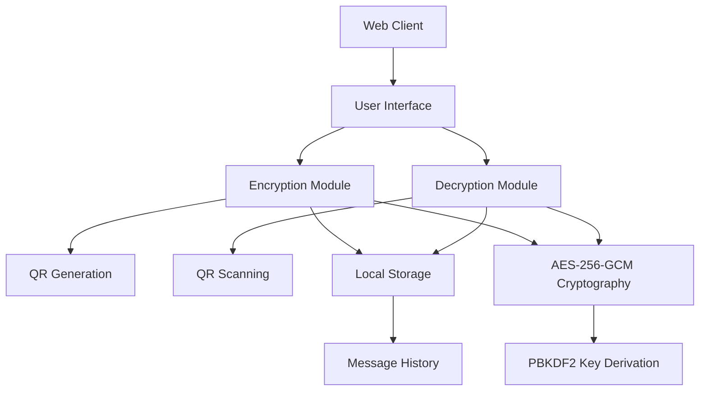
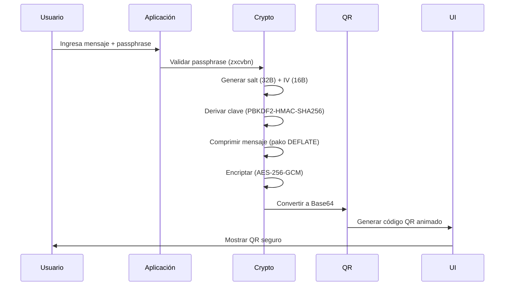
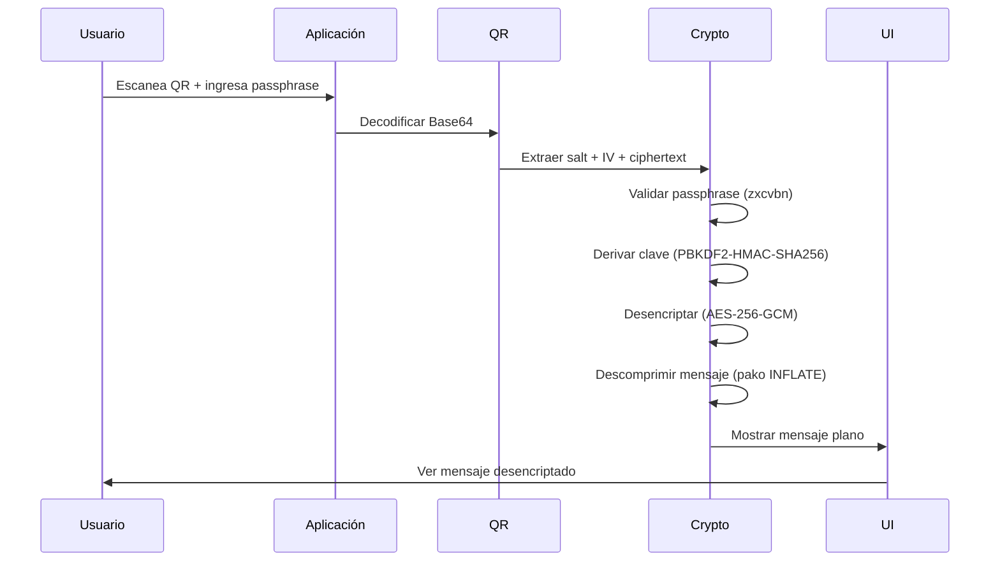
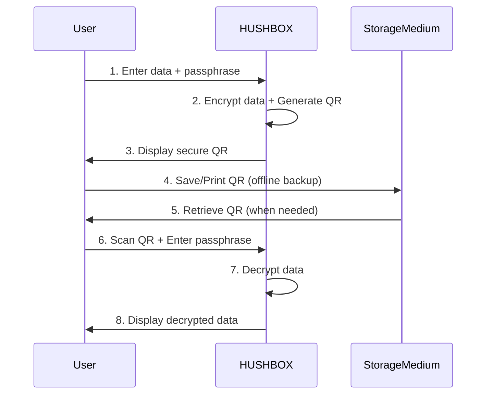
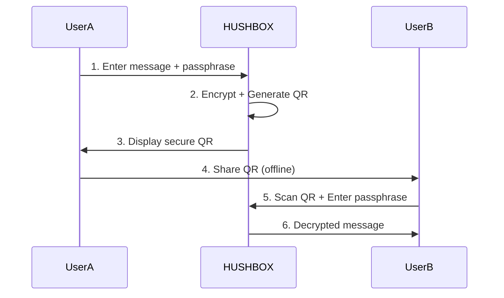
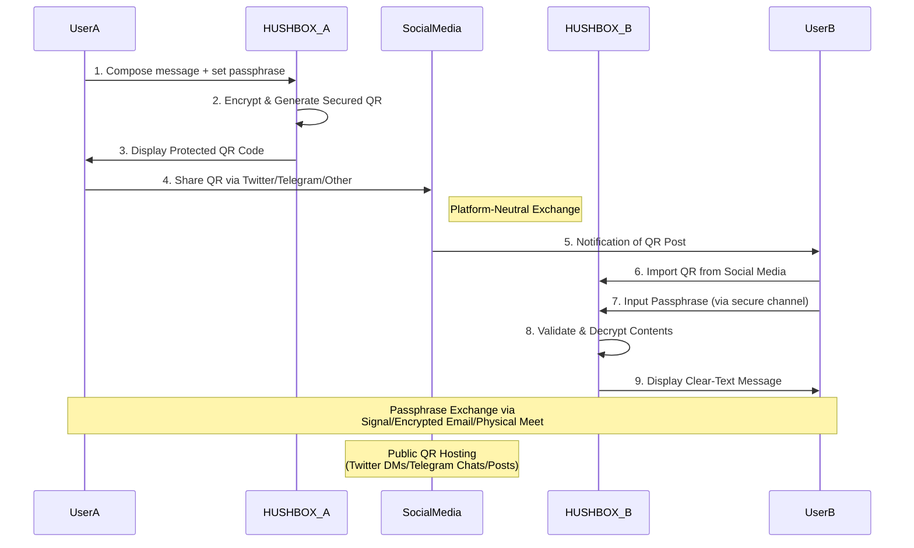
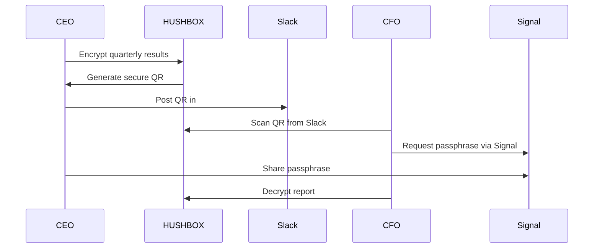
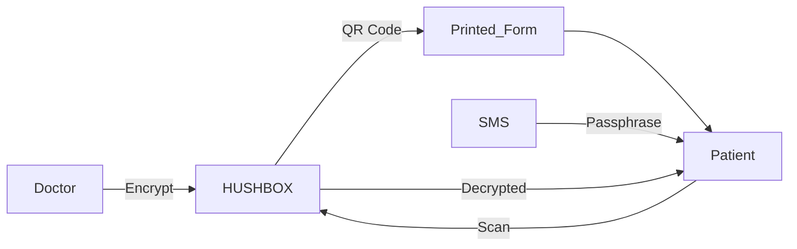
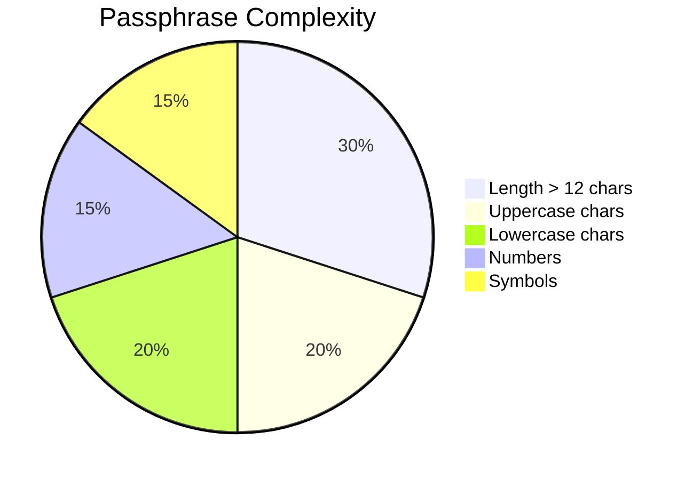
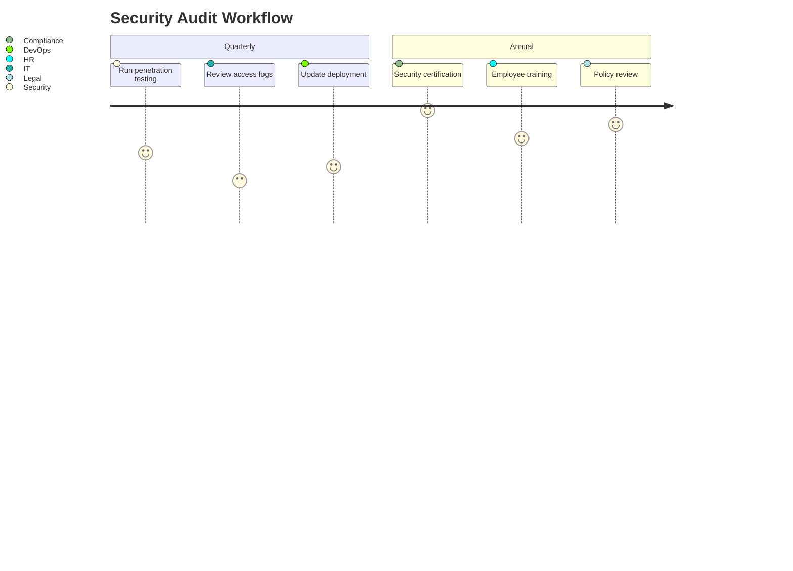

# 🔒 HUSHBOX - Your Digital Privacy Vault  

<div align="center">
    <a href="https://www.hushbox.online">Web</a> • 
    <a href="https://github.com/MPetovick/HUSHBOX">GitHub</a> • 
    <a href="https://t.me/HUSHBOX_QR">Telegram</a> • 
    <a href="https://twitter.com/HUSHBOXonline">Twitter</a>
  </p>
</div>

## 🌟 Overview  
HUSHBOX is a next-generation, privacy-first communication tool that redefines secure messaging. By combining military-grade encryption with QR code technology, HUSHBOX enables users to exchange confidential messages without ever relying on external servers.

Unlike traditional platforms, all encryption and decryption occur locally on your device, ensuring your data remains completely under your control. Messages are never stored, logged, or transmitted through third-party infrastructure. Instead, encrypted QR codes can be shared via any medium, while your passphrase remains separate—ensuring maximum security even if the message is intercepted.

🔐 **Zero-Server Architecture** – Messages never touch external servers

🕵️ **Ephemeral Design** – No tracking, no storage, no metadata

🔓 **Open Source** – Transparent and auditable security

📱 **PWA Ready** – Install as a lightweight progressive web app

📴 **Offline Functionality** – Works seamlessly without internet access

**Perfect For**:  
🔏 Privacy-conscious individuals | 🏢 Enterprises handling sensitive data | 💼 Legal/medical professionals | 🛡️ Security researchers | ✈️ Travelers in high-risk areas  

---

## 🚀 Key Features

|       **Category**       |        **Key Features**                                                                   |
|--------------------------|-------------------------------------------------------------------------------------------|
| 🔐 **Core Security**     | - AES-256-GCM encryption with HMAC integrity protection <br> - PBKDF2 key derivation (310,000 iterations) <br> - Compressed payloads for efficient QR encoding <br> - Anti-brute force protection (5 attempts limit) |
| 📱 **User Experience**   | - Responsive design with mobile-first approach <br> - Real-time passphrase strength indicators <br> - Animated QR codes with custom branding <br> - Camera QR scanning (mobile devices) *Coming Soon <br> - Social media integration for secure sharing |
| 🛡️ **Advanced Protections** | - IV time-stamping for replay attack prevention <br> - Memory sanitization after operations <br> - Secure content disposal <br> - Tamper-evident payload design|

---

## ⚙️ Technical Stack
### Frontend Architecture  

### Encryption flow

### Decryption flow



### Dependencies  
| Library | Version | Purpose | SRI Hash |
|---------|---------|---------|----------|
| **pako**     | 2.1.0   | Compression DEFLATE           | `sha256-7eJpOkpqUSa501ZpBis1jsq2rnubhqHPMC/rRahRSQc=` |
| **qrcode**   | 1.5.1   | QR Generation                 | `sha256-7GTYmrMJbc6AhJEt7f+fLKWuZBRNDKzUoILCk9XQa1k=` |
| **jsqr**     | 1.4.0   | QR Decoding                   | `sha256-TnzVZFlCkL9D75PtJfOP7JASQkdCGD+pc60Lus+IrjA=` |
| **jspdf**    | 2.5.1   | PDF export                    | `sha256-mMzxeqEMILsTAXYmGPzJtqs6Tn8mtgcdZNC0EVTfOHU=` |
| **zxcvbn**   | 4.4.2   | Passphrase validation         | `sha256-9CxlH0BQastrZiSQ8zjdR6WVHTMSA5xKuP5QkEhPNRo=` |
- **UI Framework**: Pure CSS Grid/Flex
- **Icons**: Font Awesome 6

---

## 🛠️ Installation & Usage  

### Project Structure
```bash
HUSHBOX/
├── index.html          
├── script.js           
├── styles.css          
├── manifest.json       
├── favicon.ico
├── manifest.json
├── sitemap.xml
├── assets/                 
│   └──  favicon.png
├── legal/                
│   └── LICENSE.md
│   └── privacy-police.md
│   └── terms-of-service.md
├── LICENSE
└── README.md        
```
### Local Deployment
```bash
git clone https://github.com/MPetovick/HUSHBOX.git
cd HUSHBOX
# Serve using local web server
python3 -m http.server 8000
```
Open `http://localhost:8000` in modern browser or just click index.html

### Web Version  
[https://www.hushbox.online](https://mpetovick.github.io/HUSHBOX)


### User manual
1. Visit **[hushbox.online](https://www.hushbox.online)**  
2. **Encrypt a message**:  
   - Enter passphrase (12+ characters)  
   - Type your secret message  
   - Click "Encrypt"  
   - Share the generated QR via any channel  
3. **Decrypt a message**:  
   - Scan/upload a QR code  
   - Enter the passphrase (shared separately)  
   - Click "Decrypt"  
---

## 🔄 Workflow Diagram

**Backup Workflow:**

**Offline Workflow:**

**Online Workflow:**



### Examples
### Secure Board Communication  


### Medical Data Transfer  


---

## 🛡️ Security Specifications  

### Cryptography  
| Parameter | Value | Description |
|-----------|-------|-------------|
| Algorithm | AES-256-GCM | Authenticated encryption |
| Key Derivation | PBKDF2-HMAC-SHA256 | 310,000 iterations |
| Salt | 32 bytes | Unique per encryption |
| IV | 16 bytes | Cryptographic nonce |
| Compression | DEFLATE Level 6 | For messages >100 chars |

### Passphrase Requirements  


---

## 📈 Business Applications  

### Industry Solutions  
| Sector | Use Case |
|--------|----------|
| **Finance** | Secure earnings reports transmission |
| **Healthcare** | HIPAA-compliant patient data sharing |
| **Legal** | Confidential case document exchange |
| **Government** | Classified material distribution |
| **Manufacturing** | IP-protected blueprints sharing |

### Enterprise Benefits  
- **Zero Infrastructure Costs**: No servers to maintain  
- **Compliance Ready**: Meets GDPR/HIPAA requirements  
- **Employee Training**: <15 minute onboarding  
- **Security Certification**: HBX-SEC-2025-08 compliant  
- **24/7 Support**: Enterprise SLA with 15-min response  

---

## ⚠️ Security Best Practices  

### For All Users  
1. 🔑 Always use 15+ character passphrases  
2. 📲 Share passphrases via secure channels (Signal, ProtonMail)  
3. 🧹 Clear history after sensitive operations  
4. 🔒 Use in private browsing sessions or mode offline

### For Enterprises  

---

## 📜 License  
GNU AFFERO GENERAL PUBLIC LICENSE - [View License](https://github.com/MPetovick/HUSHBOX/blob/main/LICENSE)

## 🌐 Contact  
- **Security Issues**: security@hushbox.com  
- **Enterprise Support**: enterprise@hushbox.com  
- **Community**: [Telegram](https://t.me/HUSHBOX_QR) | [Twitter](https://twitter.com/HUSHBOXonline)  
- **Documentation**: [docs.hushbox.com](https://docs.hushbox.com)  

---

<div align="center">
  <br>
  <strong>Your Secrets Deserve Better Than the Cloud</strong> ☁️❌<br>
  <strong>Try HUSHBOX Today → </strong> <a href="https://www.hushbox.online">www.hushbox.online</a><br>
</div>
